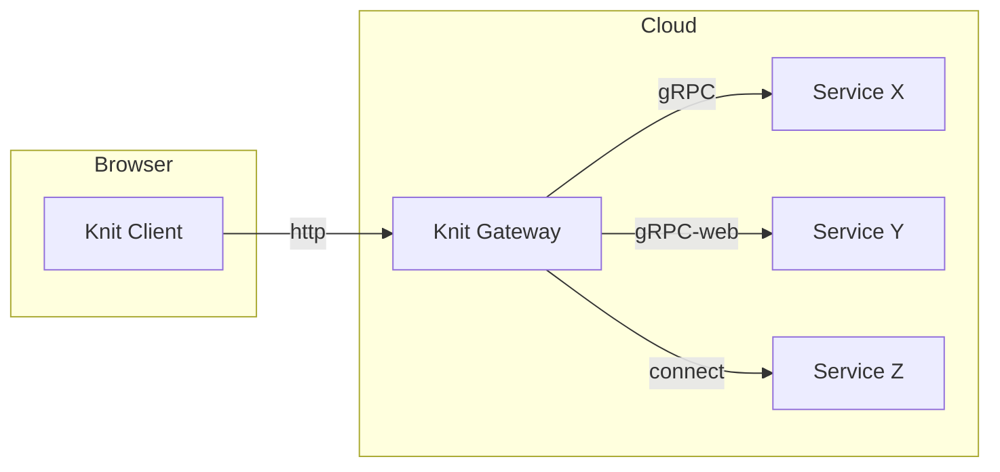
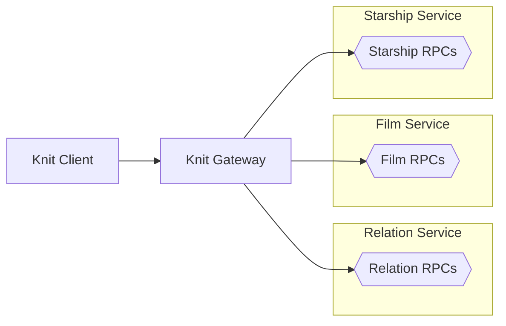
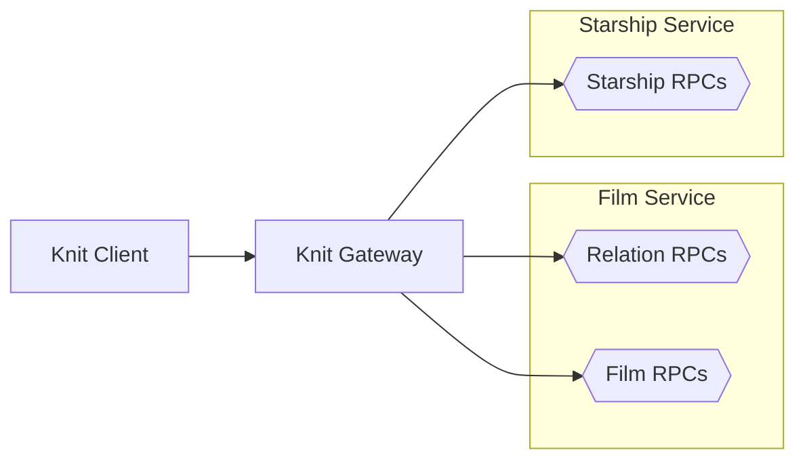
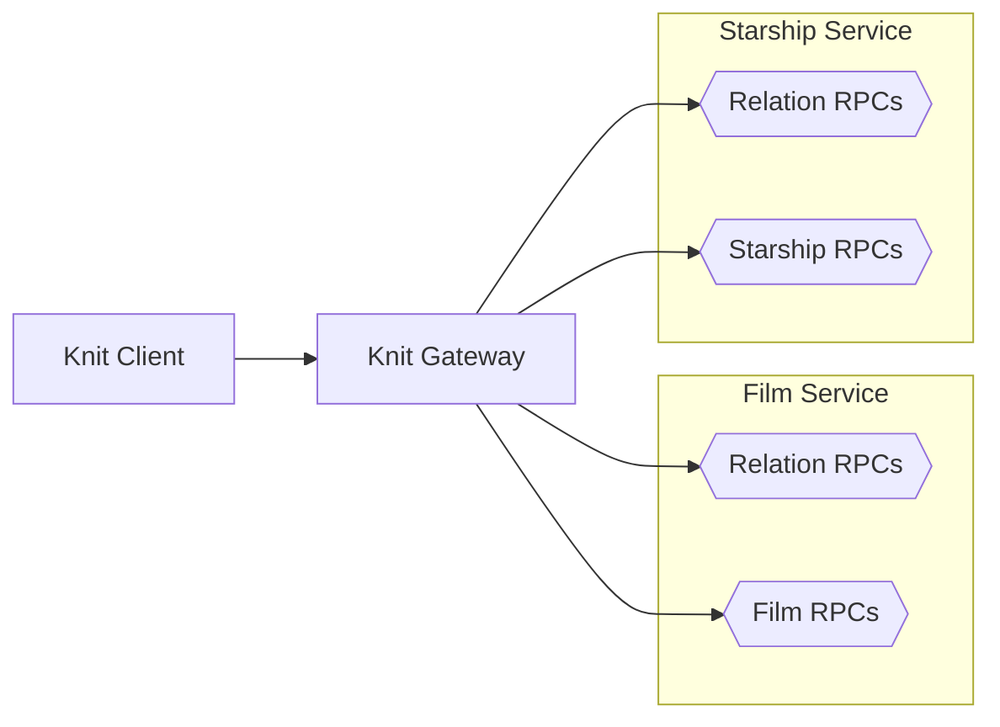
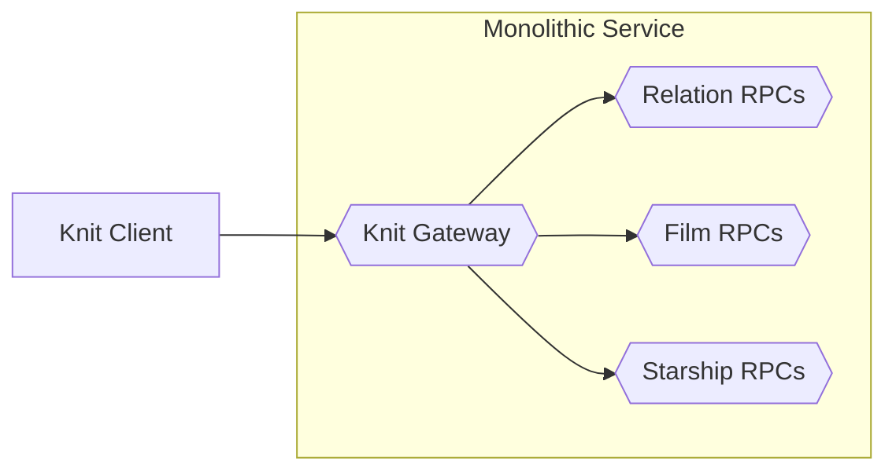

# 🧶 Knit
[][badges_license]
[][badges_slack]

**Knit brings GraphQL-like capabilities to RPCs. Knit has type-safe and
declarative queries that shape the response, batching support to eliminate
the N+1 problem, and first-class support for error handling with partial
responses. It is built on top of Protobuf and Connect.**

**Deploy the Knit gateway to call all of your Connect/gRPC services from
the web with the Knit client over HTTP/1.1 or HTTP/2. No changes to your
services are needed to use type-safe declarative queries, response masking, or the
error handling. Use more advanced feature like relations and partial responses
as the need arises.**

**Knit is currently in alpha (α), and looking for feedback. Learn how to use it with the [Tutorial].**

---
Map of Knit repositories:
- **[github.com/bufbuild/knit]**: You are here 🚀
- **[github.com/bufbuild/knit-ts]**: Knit client and embeddable gateway in TypeScript
- **[github.com/bufbuild/knit-go]**: Knit standalone gateway and embeddable gateway in Go
- **[github.com/bufbuild/knit-api]**: Protobuf custom options and gateway protocol definition
- **[github.com/bufbuild/knit-demo]**: Source for the demo app at https://knit-demo.connect.build/

## Overview

## Client queries
Knit clients specify declarative queries that pull data from multiple backend APIs
in a single call via the Knit gateway. Knit queries can shape the data into a
hierarchy that matches the needs of the caller, and can filter the response to get
only the fields the caller actually uses.

The example query below is from the Knit [Tutorial] which uses a Star Wars API as
a running example. Note that queries are actual TypeScript, not just strings:

```TypeScript
import type { FilmService } from "./gen/buf/starwars/film/v1/film_knit";
import type { StarshipService } from "./gen/buf/starwars/starship/v1/starship_knit";
import type { } from './gen/buf/starwars/relation/v1/relation_knit';
import { createClient } from "@bufbuild/knit";

// Include the services to use in the schema
type Schema = FilmService & StarshipService;

// Create a client to the Knit gateway
const client = createClient<Schema>({
  baseUrl: "https://knit-demo.connect.build/",
});

// Do the query, getting only what is needed
const filmsResult = await client.do({
  "buf.starwars.film.v1.FilmService": {
    getFilms: {
      // Use $ to provide the request.
      $: { ids: ["1"] },
      // Start selecting the fields that you want
      // in the response. They can be nested as
      // deep as needed.
      films: {
        id: {},
        title: {},
        director: {},
        releaseDate: {},
        starships: {
          // This is a relation field, it looks like a
          // normal field but it is actually coming
          // from a different rpc.
          //
          // It can also be nested as deep as needed
          // and accept parameters.
          $: { limit: 10 },
          id: {},
          name: {},
        },
      },
    },
  },
});
```

## Client methods
Knit clients issue requests via three different methods:

`fetch()` for [SAFE][safe] endpoints (GET support coming soon for better browser and CDN caching)

`do()` for mutating endpoints like create/update/delete, and always uses http POST

`listen()` for streaming endpoints, where the backend can continuously stream results to the client

## Reusing queries and co-location
Knit queries in TypeScript are TS literals, co-location and the ability to use all the constructs of
TS, like the spread `...` operator, are possible:

```TypeScript
const filmQuery = {
  id: {},
  title: {},
} satisfies Query<Film>; // Use satisfies to ensure the query is valid

const filmReleaseDates = await client.fetch({
  "buf.starwars.film.v1.FilmService": {
    getFilms: {
      $: { ids: ["1"] },
      films: {
        ...filmQuery,
        releaseDate: {},
      },
    },
  },
});
```

## Multiple queries
Knit clients can issue multiple queries in a single request. The Knit
gateway will call these in parallel, gather the results, and respond
back to the client with a single response.

```TypeScript
const filmsAndPeople = await client.fetch({
  "buf.starwars.film.v1.FilmService": {
    getFilms: {
      $: { ids: ["1"] },
      films: {
        title,
        releaseDate: {},
      },
    },
  },
  "buf.starwars.person.v1.PersonService": {
    getPeople: {
      $: { ids: ["1"] },
      people: {
        name,
      },
    },
  },
});
```

## Schema first
Because Knit builds on top of Protocol Buffers, it is schema first. This makes
the Knit clients strongly typed, improving the developer experience, and gives
access to all the tooling that proto schemas have for linting, formatting,
breaking change detection, and multi-language code generation. See the [buf CLI]
for example.

This also means that Knit client queries are actual TypeScript object literals,
and code generation is required only once, not per query.

## Relations between services
Relations extend the available fields in a type without needing to modify
the original proto definition of that type. Relations between entities in
independent APIs are created by defining an RPC, and adding the
`buf.knit.relation` option to the RPC definition.

Using the `Film` and `Starship` types from the [Tutorial] as an example, a
relationship can be made by defining a Knit RPC that extends `Film` with a
`starships` field usable by the Knit client. One side of the relationship
is defined in the request message of the RPC defining the relation, the
other side is defined in the response message:

```protobuf
// Defined in file film.proto
message Film {
    string film_id = 1;
    string title = 2;
    repeated string starship_ids = 3;
}
```

```protobuf
// Defined in file starship.proto
message Starship {
    string starship_id = 1;
    string name = 2;
    uint64 model = 3;
}
```

```protobuf
// Defined in file relation.proto
service RelationService {
    rpc GetStarshipsForFilm(StarshipsForFilmRequest) returns (StarshipsForFilmResponse) {
        option (buf.knit.relation).name = "starships";
    }
}

// Relation requests always need to accept a batch of inputs
message StarshipsForFilmRequest {
    repeated Film bases = 1;
}

// Relation responses always return a corresponding batch of outputs
message StarshipsForFilmResponse {
    repeated Result values = 1;
    message Result {
        repeated Starship starships = 1;
    }
}
```

The difference between just adding a new field to the base type and using a
Knit relation, is that with a relation, these new fields can be added
after-the-fact and without updating the base types.

The RPCs that define relationships do not need to be put into their own service,
however in the [Tutorial] they have been put into their own `RelationService` so that
it is clear this is possible.

Once a relation RPC is defined a Knit client can call the RPCs of the base service,
in the [Tutorial] that would be the `FilmService` or the `StarshipService`, and use
the new field defined in the relation as if it was defined in the base type itself:

```TypeScript
const resp = await client.do({
  "buf.starwars.film.v1.FilmService": {
    getFilms: {
      $: { filmIds: ["1","2"] },
      films: {
        title: {},
        // The "starships" field does not exist
        // on Film, but because of the relation
        // RPC it is available to use by Knit
        // clients as if it was defined on Film.
        starships: {
          $: {},
          model: {},
        },
      },
    },
  },
});
```

## Components
Systems using Knit will have three types of components:

1. Knit clients
2. gRPC, gRPC-web, or Connect services
3. Knit gateways (embedded or using the standalone gateway)

### Clients
Knit clients issue Knit queries to Knit gateways using the Connect
protocol over https (or http), making Knit usable in the browser. 🧑‍💻 🌐

The client is currently only available for TypeScript. Read the [Tutorial]
to learn how to use the client, or see  [github.com/bufbuild/knit-ts] for
detailed specifics.

### Services
Services are normal gRPC, gRPC-web or Connect protocol services,
and require no special Knit tooling. That means all existing such
services work with Knit out of the box.

Services are defined in any languge that has support for gRPC, gRPC-web or
the Connect protocol. The [Tutorial] uses [connect-es] and [connect-go] in
its examples.

### Gateways
The Knit gateway knows how to execute Knit queries from Knit clients, which
may require calling the RPCs of other services, and the Knit gateway
knows how to issue them in the correct order, and flow required data from
responses into subsequent requests until a query is fully executed.

The Knit gateway is available as a standalone binary, or it can be embedded
in a TypeScript service or Go service. The [Tutorial] shows how to use both
types.

## Deployment
Knit can be used with all gRPC, gRPC-web and Connect protocol services
without any modifications. The Knit gateway  can be configured to point
to any number of services, allowing Knit clients to call all of them out
of the box.

As the need arises more advanced usage of Knit can be employed, such as using
relations, or splitting the system into finer grain RPCs (independent of the
services they are defined in).

Below are several examples using the Star Wars API from the Knit [Tutorial]
to show how parts of the system could be organized:

#### Everything independent


#### Relations embedded in an existing service


#### Relations embedded across existing services


#### One backend monolith when using the embeddable gateway in TypeScript or Go


## Learning to use Knit
Knit has an end-to-end [Tutorial] that use the Star Wars API as a running example, and
fully working code with longer explanations:

* [Star Wars Knit client app in TypeScript](/tutorial/starwars-knit-client-app-ts) 🧑‍💻 🌐
* [Star Wars Knit gateway](/tutorial/starwars-knit-gateway-standalone) or [(embeddable gateway in Go)](/tutorial/starwars-knit-gateway-go)
* [Star Wars Knit relation service in TypeScript](/tutorial/starwars-knit-relation-service-ts) or [Go](/tutorial/starwars-knit-relation-service-go)
* [Star Wars film service in TypeScript](/tutorial/starwars-film-service-ts) or [Go](/tutorial/starwars-film-service-go)
* [Star Wars starship service in TypeScript](/tutorial/starwars-starship-service-ts) or [Go](/tutorial/starwars-starship-service-go)

[badges_license]: https://github.com/bufbuild/knit/blob/main/LICENSE
[badges_slack]: https://buf.build/links/slack
[Tutorial]: /tutorial
[github.com/bufbuild/knit]: https://github.com/bufbuild/knit
[github.com/bufbuild/knit-ts]: https://github.com/bufbuild/knit-ts
[github.com/bufbuild/knit-go]: https://github.com/bufbuild/knit-go
[github.com/bufbuild/knit-demo]: https://github.com/bufbuild/knit-demo
[github.com/bufbuild/knit-api]: https://github.com/bufbuild/knit-api
[github.com/bufbuild/connect-es]: https://github.com/bufbuild/connect-es
[github.com/bufbuild/connect-go]: https://github.com/bufbuild/connect-go
[connect-es]: https://github.com/bufbuild/connect-es
[connect-go]: https://github.com/bufbuild/connect-go
[knit-ts]: https://github.com/bufbuild/knit-ts
[knit-go]: https://github.com/bufbuild/knit-go
[buf CLI]: https://github.com/bufbuild/buf
[safe]: https://developer.mozilla.org/en-US/docs/Glossary/Safe/HTTP
