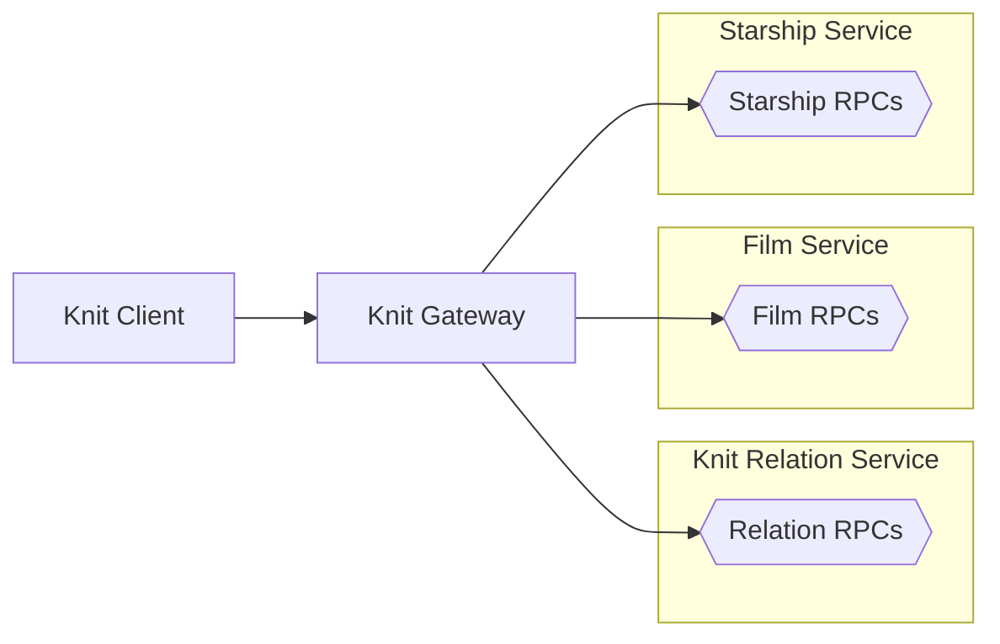

# 🧶 Knit Turorial

[Back to top level README]

The Knit tutorial uses the Star Wars API as a running example
throughout. It contains the following parts:

* [Star Wars Knit client app in TypeScript](/tutorial/starwars-knit-client-app-ts) 🧑‍💻 🌐
* [Star Wars Knit gateway](/tutorial/starwars-knit-gateway-standalone) or [(embeddable gateway in Go)](/tutorial/starwars-knit-gateway-go)
* [Star Wars Knit relation service in TypeScript](/tutorial/starwars-knit-relation-service-ts) or [Go](/tutorial/starwars-knit-relation-service-go)
* [Star Wars film service in TypeScript](/tutorial/starwars-film-service-ts) or [Go](/tutorial/starwars-film-service-go)
* [Star Wars starship service in TypeScript](/tutorial/starwars-starship-service-ts) or [Go](/tutorial/starwars-starship-service-go)

All parts of the tutorial include full code which can be run from the
terminal. Give the system a try by cloning this repo with 
`git clone https://github.com/bufbuild/knit.git` and launch the
separate parts by following the instructions in their respective READMEs
linked above. 

## Parts of the tutorial
The tutorial chooses to use individual processes for everything, so each
component is its own sub-directory and has its own README that shows how
to run that part of the system:

The Knit client app issues queries via the the Knit gateway. Executing
Knit queries in the gateway may require calling the RPCs of the other
services, and the Knit gateway plans out the correct order, and flow 
of required data from responses into subsequent requests until a query
is fully executed.

The Film service and Starship service are just normal gRPC services.
In this tutorial they are built using [connect-es] and [connect-go], 
there is nothing Knit specific about them, however they are needed
for the tutorial.

The Knit `RelationService` extends the `Film` of `FilmService` with a
new field called `starships`, without needing to modify `Film` or
`FilmService`, and shows how such relations can be added to a system
using Knit.

## Installing tools before you start
Writing the services and client app from scratch will require the
`buf` CLI, Node.js and Go, see the install instructions for the
[buf CLI], [Node.js] and [Go].

[Knit README]: https://github.com/bufbuild/knit/
[Back to top level README]: https://github.com/bufbuild/knit/
[knit-ts]: https://github.com/bufbuild/knit-ts/
[knit-go]: https://github.com/bufbuild/knit-go/
[connect-go]: https://github.com/bufbuild/connect-go
[connect-es]: https://github.com/bufbuild/connect-es
[buf cli]: https://buf.build/docs/installation/
[node.js]: https://nodejs.org/en
[go]: https://go.dev/