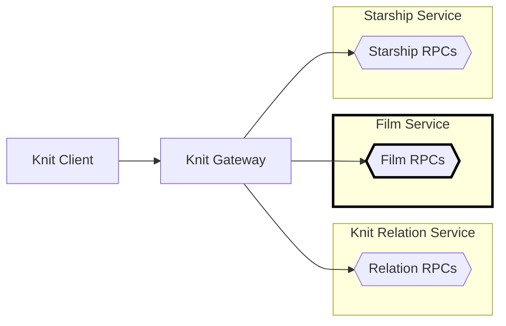

# Star Wars Film Service in Go

[Back to top of Tutorial]

The film service is not strictly 🧶 Knit, it's just a simple gRPC service
written using [connect-go], but it's needed for the other parts of the
tutorial. Feel free to just run this service and go on to the Knit
specific parts. The film service is made to listen on address
`http://localhost:18001`. Look at the process diagram below
to see where the film service fits into the bigger
picture.



## How to run the code
To run the film service clone the repo using `git clone https://github.com/bufbuild/knit.git`,
then execute the following from the base of the repository (the other services must be running too).

[][badges_slack]
```
cd tutorial/starwars-film-service-go/cmd/filmservice/

go mod tidy
go run filmservice.go

# Output
2023/05/01 11:33:03 Film service starting
2023/05/01 11:33:03 Handling connect service at prefix: /buf.starwars.film.v1.FilmService/
2023/05/01 11:33:03 Listening on: 127.0.0.1:18001
```

Open another terminal, and at the base directory do:
```
buf curl \
"http://localhost:18001/buf.starwars.film.v1.FilmService/GetFilms" \
--data '{"filmIds":["1"]}' \
--http2-prior-knowledge \
--schema tutorial/starwars-film-service-go/proto/buf/starwars/film/v1/film.proto
```

[Back to top of Tutorial]: /tutorial
[github.com/bufbuild/knit]: https://github.com/bufbuild/knit
[connect-go]: https://github.com/bufbuild/connect-go
[badges_slack]: https://buf.build/links/slack