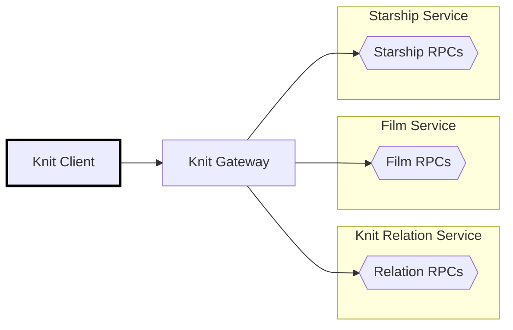
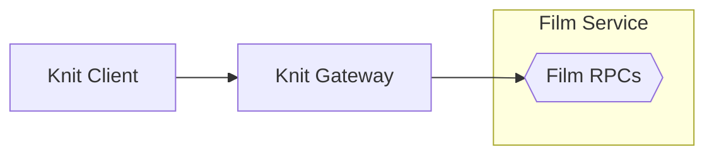
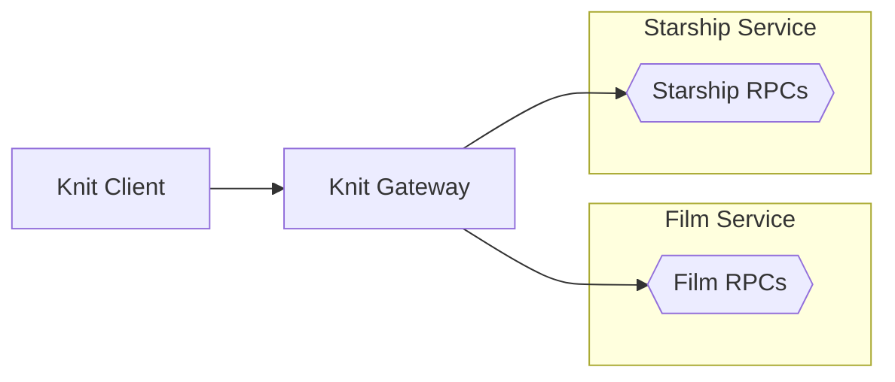
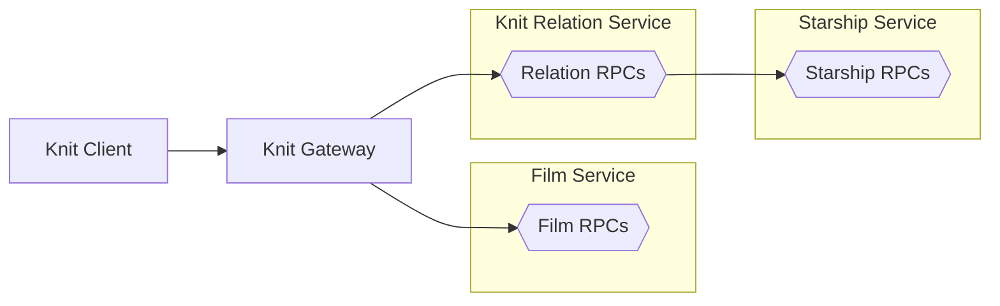
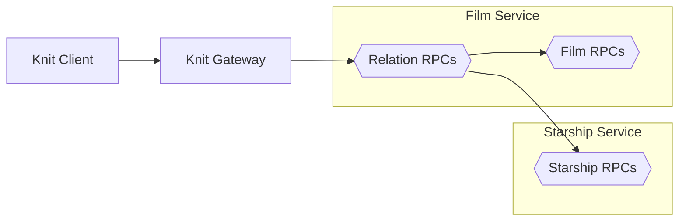

# 🧶 Knit Client App (in TypeScript)

[Back to top of Tutorial]

In this tutorial the Knit Client app is implemented in TypeScript using [knit-ts],
[react.js] and [vite]. It calls the Knit Gateway to query for films with starships.



## How to run the code
To run the Knit client app clone the repo using `git clone https://github.com/bufbuild/knit.git`,
then execute the following from the base of the repository (the other services must be running too).

[][badges_slack]
```
cd tutorial/starwars-knit-client-app-ts/

npm install
npm run dev

# Output
  VITE v4.2.2  ready in 266 ms
  ➜  Local:   http://localhost:5173/
  ➜  Network: use --host to expose
  ➜  press h to show help
```

## Writing the Star Wars Knit app from scratch

Create the app in this tutorial by starting a new react-ts application,
which in this tutorial is created with [vite], but any alternative to
vite will also work:

```
npm create vite@latest starwars-knit-client-app-ts -- --template react-ts
```

## Install dependencies
Install the dependencies needed for a Knit application:
```
npm install \
    @bufbuild/buf \
    @bufbuild/protobuf \
    @bufbuild/protoc-gen-es \
    @connectrpc/connect \
    @connectrpc/protoc-gen-connect-es \
    @bufbuild/knit
```

And the dev dependencies:
```
npm install --save-dev @bufbuild/protoc-gen-knit-es
```

## Using the Knit client in the app
The full contents of `App.tsx` are shown below, but broken down into
relevant sections. Because this is a [react.js] app, it starts with the
typical imports:

```TypeScript
import { useState } from 'react'
import './App.css'
```

The Knit client needs to import the types for the services that will
be called. In this case those are the  `FilmService` and the
`StarshipService`.

If the application is using relations, their definitions must be imported.
Importing the relation definitions will augment the types from the
`FilmService` and `StarshipService` with fields defined in the
`RelationService` for those types.

The next import is for the `createClient` function which will create the
Knit client given the URL of the Knit gateway and the types of the
service meant to be callable by this client. By specifying both the
`FilmService` and the `StarshipService` all RPCs in those services will
be usable from this client.

Lastly, in this tutorial the Knit gateway actually runs at `localhost:8080`,
but has been specified as `http://localhost:5173/knit`, that's because the
path `/knit` is used with vite's server proxy and configured in
`vite.config.ts`.

```TypeScript
import type { FilmService } from '../gen/buf/starwars/film/v1/film_knit';
import type { StarshipService } from '../gen/buf/starwars/starship/v1/starship_knit';
import type { } from '../gen/buf/starwars/relation/v1/relation_knit';
import { createClient } from '@bufbuild/knit';

const client = createClient<FilmService & StarshipService>({
  baseUrl: 'http://localhost:5173/knit', // Knit gateway URL
})
```

Next the `App` function is defined, which itself has the `callKnit` function
where the Knit client is used. Any RPC in `FilmService` or `StarshipService`
could be called in `client.do()`, including calling multiple RPCs at the same
time.

If the code below were changed to call multiple RPCs at the same time,
the Knit client would still make just one request to the Knit gateway, but the
Knit gateway would parallelize the calls, bundle their responses into a single
response, and return that to the client.

```TypeScript
function App(): JSX.Element {
  const [data, setFilms] = useState(new Array<{title: string, models: string[]}>());

  async function callKnit() {
    const resp = await client.do({
      "buf.starwars.film.v1.FilmService": {
        getFilms: {
          $: { filmIds: ["1","2"] },
          films: {
            title: {},
            // Any field that is defined in a relation,
            // like the starships field here, requires
            // the import of the relation definition,
            // in this case it is in relation_knit
            starships: {
              $: {},
              model: {},
            },
          },
        },
      },
    });

    const films = resp['buf.starwars.film.v1.FilmService'].getFilms.films.map(film => {
      return {
        title: film.title,
        models: film.starships.map(ship => ship.model),
      }
    });

    setFilms(films);
  }

  return (
    <div className="App">
      <div>
        <a href="https://github.com/bufbuild/knit" target="_blank">
          <h1>🧶</h1>
        </a>
      </div>
      <h1>Vite + React + Knit</h1>
      <div className="card">
        <button onClick={callKnit}>
          Get Films & Starships
        </button>
      </div>
      <div>
        {data.map((v) => <div key={v.title}>{Film(v.title, v.models)}</div>)}
      </div>
    </div>
  )
}
```

The `App.tsx` then ends with a simple `Film` component for rendering the results,
and the standard `export default App` statement.

```TypeScript
function Film(title: string, starships: string[]): JSX.Element {
  return (
    <div key={title} className="film">
      <div className="title">{title}</div>
      {starships.map(model => <div key={model}>{model}</div>)}
    </div>
  )
}

export default App
```

## How queries map to RPC calls

### Query with single RPC
A simple query that references a single service will call
through the gateway, which will then call the appropriate
RPC within that service, in this case the `getFilms` RPC
in the `FilmService`:
```TypeScript
client.do({
  "buf.starwars.film.v1.FilmService": {
    getFilms: {
      $: { filmIds: ["1","2"] },
      films: {
        title: {},
      },
    },
  },
});
```



### Query with multiple RPCs
A query that references more than one service, but without a relation
between them, calls through the Knit gateway, and then the Knit
gateway in parallel calls out to the appropriate RPC in the respective
services. In this case the `getFilms` RPC in the `FilmService` and
the `getStarships` RPC in the `StarshipService`. The Knit gateway gathers
the responses from the multiple calls, and returns a single bundled
response to the Knit client:

```TypeScript
client.do({
  "buf.starwars.film.v1.FilmService": {
    getFilms: {
      $: { filmIds: ["1","2"] },
      films: {
        title: {},
      },
    },
  },
  "buf.starwars.starship.v1.StarshipService": {
    getStarships: {
      $: { starshipIds: ["3","4"] },
      starships: {
        model: {},
        crew: {},
      },
    },
  },
});
```



### Query with relation RPC
A relation defines a relationship between entities that exist in
independent APIs, like `Film` in the `FilmService` and `Starship`
in the `StarshipService`. See how relations are defined in the
[Top level README].

A knit client always uses the normal RPCs defined in the base services, it
never needs call the RPCs defined by relations, those are used by the Knit
gateway.

No matter how complex or deep the hierarchy of the query and the
relations within, the Knit gateway can always figure out the call
graph and execute it:

```TypeScript
client.do({
  "buf.starwars.film.v1.FilmService": {
    getFilms: {
      $: { filmIds: ["1","2"] },
      films: {
        title: {},
        starships: {
          $: {},
          model: {},
        },
      },
    },
  },
});
```



### Queries are not affected by where relation RPCs are implemented
RPCs defining a relation do not need to be in their own service, they can be
defined in any service.

Using this tutorial as an example, it would be possible to move the RPC
`getFilmStarships` in the `RelationService` into the `FilmService` or the
`StarshipService` and remove `RelationService`. No changes would be needed
to the query shown below. This is possible because the Knit gateway abstracts
the Knit clients from these details.

Below is the call graph of the same query to get films and their starships,
but with the relation RPC linking films to starships moved into the
`FilmService`:

```TypeScript
client.do({
  "buf.starwars.film.v1.FilmService": {
    getFilms: {
      $: { filmIds: ["1","2"] },
      films: {
        title: {},
        // The field starships is from a Knit RPC
        // that defines a relation between film
        // and starship entities - in the Film
        // Service and Starship Service.
        starships: {
          $: {},
          model: {},
        },
      },
    },
  },
});
```




[Tutorial]: /tutorial
[Back to top of Tutorial]: /tutorial
[Star Wars Knit relation service in Go]: /tutorial/starwars-knit-relation-service-go
[knit-ts]: https://github.com/bufbuild/knit-ts
[Top level README]: https://github.com/bufbuild/knit/tree/add-film-service-ts#relations-between-services
[react.js]: https://react.dev/
[vite]: https://vitejs.dev/
[badges_slack]: https://buf.build/links/slack
