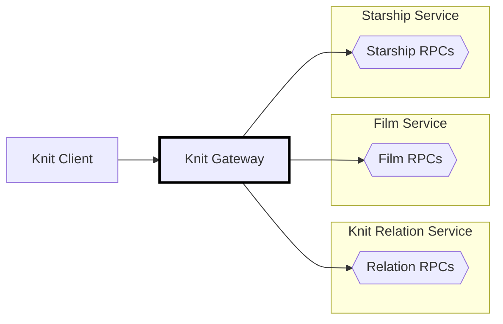

# 🧶 Knit Gateway in Go

[Back to top of Tutorial]

In this tutorial the Knit gateway is implemented using [knit-go], and is made to
listen on address `http://localhost:8080`. Look at the process diagram below to
see where the Knit gateway fits into the bigger picture.

The Knit gateway is what puts the magic into a system using Knit. The gateway is
called by Knit clients, and based on the clients' queries automatically issues
RPCs to the required backend services to evaluate a query. The gateway will
automatically batch and parallelize the requests, issue them in the correct
order, and flow required data from responses into subsequent requests until a
query is fully executed.



## How to run the code
To run the Knit gateway service clone the repo using `git clone https://github.com/bufbuild/knit.git`,
then execute the following from the base of the repository (the other services must be running too).

[][badges_slack]
```
cd tutorial/starwars-knit-gateway-go/cmd/gateway

go mod tidy
go run gateway.go

# Output
2023/05/01 11:32:49 Knit gateway starting
2023/05/01 11:32:49 Listening on: 127.0.0.1:8080
```

[Back to top of Tutorial]: /tutorial
[github.com/bufbuild/knit]: https://github.com/bufbuild/knit
[knit-go]: https://github.com/bufbuild/knit-go
[badges_slack]: https://buf.build/links/slack
