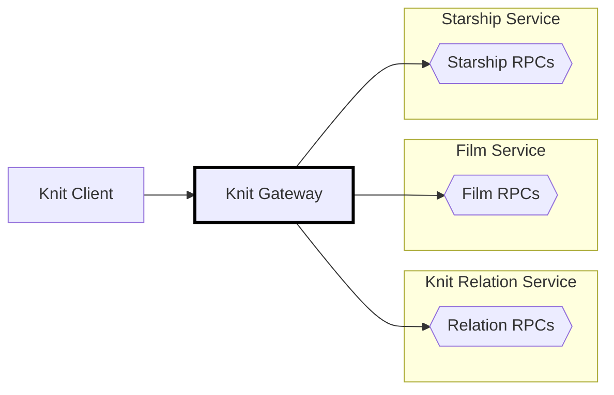

# 🧶 Knit Gateway (Standalone)

[Back to top of Tutorial]

In this tutorial the Knit standalone gateway is configured to use the Film
Service, Starship Service, and Relation Service to reslove requests, and is
made to listen on address `http://localhost:8080`. Look at the process diagram
below to see where the Knit gateway fits into the bigger picture.

The Knit gateway is what puts the magic into a system using Knit. The gateway is
called by Knit clients, and based on the clients' queries automatically issues
RPCs to the required backend services to evaluate a query. The gateway will
automatically batch and parallelize the requests, issue them in the correct
order, and flow required data from responses into subsequent requests until a
query is fully executed.



## How to run the code
To install the Knit standalone gateway clone the [knit-go] repo using
`git clone https://github.com/bufbuild/knit-go.git`, then execute the
following from the base of the repository:

```
cd cmd/knitgateway

go mod tidy
go install

# Try running the gateway, it should error because
# there is no configuration file.
knitgateway

# Output
2023/04/26 16:45:52 failed to load config from knitgateway.yaml: open knitgateway.yaml: no such file or directory
```

To get the configuration file for the tutorial clone the [knit] repo using
`git clone https://github.com/bufbuild/knit.git`, then execute the following
from the base of the repository (the other services must be running too).

[][badges_slack]
```
cd tutorial/starwars-knit-gateway-standalone

knitgateway

# Output
2023/04/26 16:48:00 Listening on 127.0.0.1:8080 for HTTP requests...
```

## Configuring the gateway
The `knitgateway` looks for a file called `knitgateway.yaml` in the current
working directory, or it can be invoked as `knitgateway -conf <file>` for a
specific configuration path and file.

The configuration used for this tutorial is shown below. Because the tutorial has
each service running in its own backend process, each service has its own section
under `backends`:

```yaml
listen:
  bind_address: 127.0.0.1
  port: 8080

backends:
- route_to: http://127.0.0.1:18000
  services:
    - buf.starwars.relation.v1.RelationService
  descriptors:
    descriptor_set_file: schema.protoset
- route_to: http://127.0.0.1:18001
  services:
    - buf.starwars.film.v1.FilmService
  descriptors:
    descriptor_set_file: schema.protoset
- route_to: http://127.0.0.1:18002
  services:
    - buf.starwars.starship.v1.StarshipService
  descriptors:
    descriptor_set_file: schema.protoset
```

## Schema
The `knitgateway.yaml` in this tutorial sets the Knit gateway to look for the schema
of all three services in the binary file called `schema.protoset`, which can be
recreated by using the `buf build` command:

```
buf build proto -o schema.protoset
```

Note that the `knitgateway` can be configured to find the schema of the services it
calls in many different ways, including using the [Buf Schema Registry] and gRPC
reflection.

## Configuration options
The gateway itself is configured with:

* `bind_address`: The address on which to listen, defaults to 127.0.0.1 if not provided
* `port`: The port number on which to listen, defaults to an ephemeral port if not provided

The rest of the configuration found under the `backends` key word configures
the gateway with:

* Locations of processes that the gateway needs to call
* Services within those processes that speak the gRPC, gRPC-web, or connect protocol
* Methods of gettings the schema, aka: getting the descriptors, of those services

The relevant parameters are:
* `route_to`: The base URL for a backend process
* `services`: The list of fully-qualified service names running in a backend process
* `descriptors`: The method to use to discover the schema of all the services running in a backend process
* `descriptor_set_file`: The file name of the `.protoset` containing the schema for a bundle of services

See the [knit-go] repo for all the details of how the Knit standalone gateway
can be configured, including the many different ways the gateway can find
service schemas.

[Back to top of Tutorial]: /tutorial
[github.com/bufbuild/knit]: https://github.com/bufbuild/knit
[knit]: https://github.com/bufbuild/knit
[knit-go]: https://github.com/bufbuild/knit-go
[descriptor set examples]: https://github.com/bufbuild/knit-go#descriptor-set-examples
[badges_slack]: https://buf.build/links/slack
[file descriptor set]: https://github.com/protocolbuffers/protobuf/blob/v22.0/src/google/protobuf/descriptor.proto#L54-L58
[gRPC server reflection]: https://github.com/grpc/grpc/blob/master/doc/server-reflection.md
[buf schema registry]: https://buf.build/