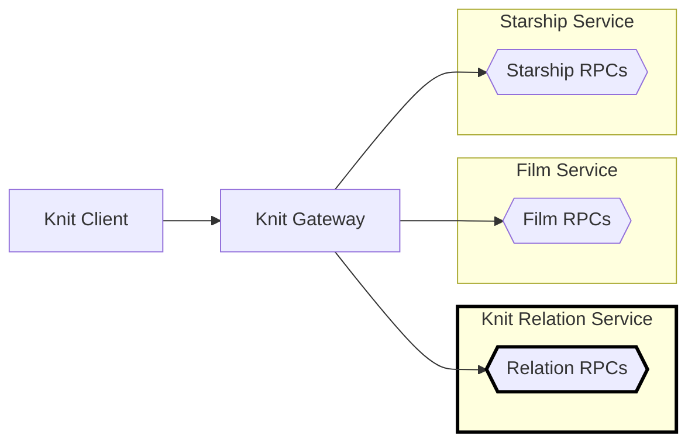

# 🧶 Knit Relation Service in Go

[Back to top of Tutorial]

In this tutorial the Knit relation service is implemented using [connect-go],
and is made to listen on address `http://localhost:18000`. Look at the process
diagram below to see where the Knit relation service fits into the bigger
picture. 



## How to run the code
To run the Knit relation service clone the repo using `git clone https://github.com/bufbuild/knit.git`,
then execute the following from the base of the repository (the other services must be running too).

[][badges_slack]
```
cd tutorial/starwars-knit-relation-service-go/cmd/relationservice

go mod tidy
go run starshipservice.go

# Output
2023/05/01 11:32:40 Knit relation service starting
2023/05/01 11:32:40 Handling connect service at prefix: /buf.starwars.relation.v1.RelationService/
2023/05/01 11:32:40 Listening on: 127.0.0.1:18000
```

[Back to top of Tutorial]: /tutorial
[github.com/bufbuild/knit]: https://github.com/bufbuild/knit
[connect-go]: https://github.com/bufbuild/connect-go
[badges_slack]: https://buf.build/links/slack

## Defining relations
Relations between entities in independent APIs are created by defining an RPC,
and adding the `buf.knit.relation` option.

One side of the relationship is defined in the request, eg: `Film`, and the other
side of the relationship is defined in the response, eg: `Starship`, the request
must be able to take a batch of inputs, and the relationship can be one-to-many,
like in the example here:

```protobuf
message GetFilmStarshipsRequest {
    repeated Film bases = 1;
}

message GetFilmStarshipsResponse {
    repeated Value values = 1;
    message Value { repeated Starship starships = 1; }
}

service RelationService {
    rpc GetFilmStarships(GetFilmStarshipsRequest) returns (GetFilmStarshipsResponse) {
        option (buf.knit.relation).name = "starships";
    }
}
```

*The RPCs that define relationships do not need to be put into their own service,
but in this tutorial they have been put into their own Relation Service so that
it is clear this is possible.*

Once a relation RPC is defined a Knit client can call the RPCs of the base service,
the `FilmService` if using the example above, and use the new field defined in the
relation as if it was defined in the base type itself:

```TypeScript
const resp = await client.do({
  "buf.starwars.film.v1.FilmService": {
    getFilms: {
      $: { filmIds: ["1","2"] },
      films: {
        title: {},
        // The "starships" field does not exist
        // on Film, but because of the relation
        // RPC it is available to use by Knit
        // clients.
        starships: {
          $: {},
          model: {},
        },
      },
    },
  },
});
```