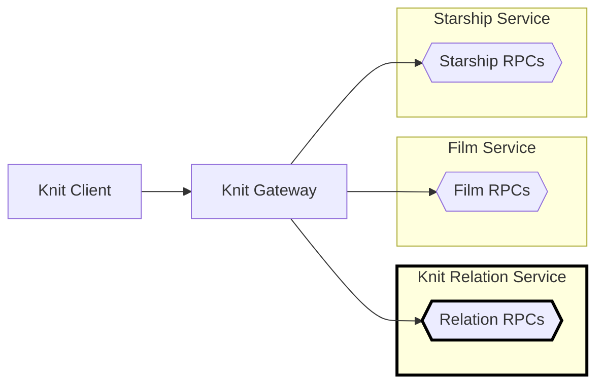

# 🧶 Knit Relation Service in Go

[Back to top of Tutorial]

In this tutorial the Knit relation service is implemented using [connect-go],
and is made to listen on address `http://localhost:18000`. Look at the process
diagram below to see where the Knit relation service fits into the bigger
picture. 



## How to run the code
To run the Knit relation service clone the repo using `git clone https://github.com/bufbuild/knit.git`,
then execute the following from the base of the repository (the other services must be running too).

[][badges_slack]
```
cd tutorial/starwars-knit-relation-service-go/cmd/relationservice

go mod tidy
go run starshipservice.go

# Output
2023/05/01 11:32:40 Knit relation service starting
2023/05/01 11:32:40 Handling connect service at prefix: /buf.starwars.relation.v1.RelationService/
2023/05/01 11:32:40 Listening on: 127.0.0.1:18000
```

## Relations between services
An explanation of how relations between services and their entities are
defined is available in the [Top level Knit README].

[Top level Knit README]: https://github.com/bufbuild/knit#relations-between-services
[Back to top of Tutorial]: /tutorial
[github.com/bufbuild/knit]: https://github.com/bufbuild/knit
[connect-go]: https://github.com/bufbuild/connect-go
[badges_slack]: https://buf.build/links/slack
