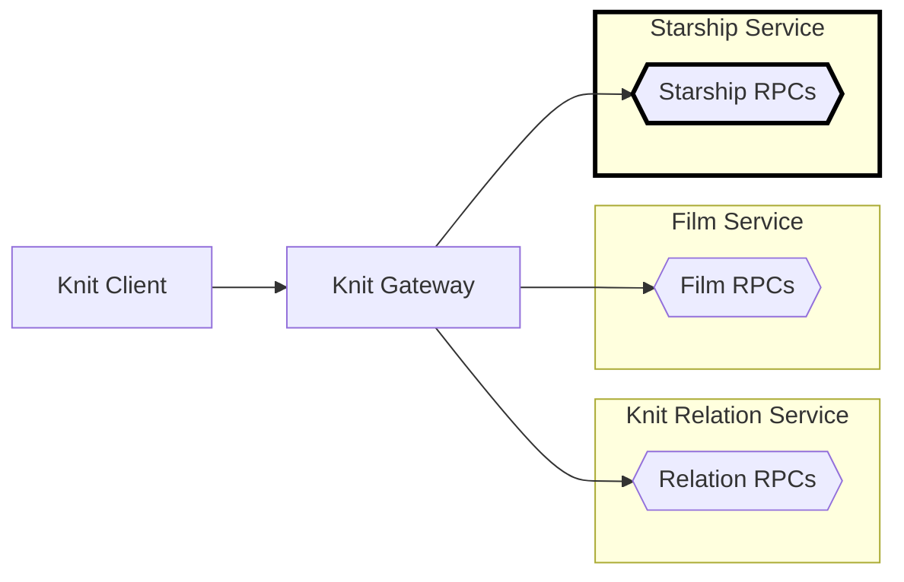

# Star Wars Starship Service in Go

[Back to top of Tutorial]

The starship service is not strictly 🧶 Knit, it's just a simple gRPC service
written using [connect-go], but it's needed for the other parts of the
tutorial. Feel free to just run this service and go on to the Knit
specific parts. The starship service is made to listen on address
`http://localhost:18002`. Look at the process diagram below
to see where the starship service fits into the bigger
picture.



## How to run the code
To run the starship service clone the repo using `git clone https://github.com/bufbuild/knit.git`,
then execute the following from the base of the repository (the other services must be running too).

[][badges_slack]
```
cd tutorial/starwars-starship-service-go/cmd/starshipservice

go mod tidy
go run starshipservice.go

# Output
2023/05/01 11:32:57 Starship service starting
2023/05/01 11:32:57 Handling connect service at prefix: /buf.starwars.starship.v1.StarshipService/
2023/05/01 11:32:57 Listening on: 127.0.0.1:18002
```

Open another terminal, and at the base directory do:
```
buf curl \
"http://localhost:18002/buf.starwars.starship.v1.StarshipService/GetStarships" \
--data '{"starshipIds":["2"]}' \
--http2-prior-knowledge \
--schema tutorial/starwars-starship-service-go/proto/buf/starwars/starship/v1/starship.proto
```

[Back to top of Tutorial]: /tutorial
[github.com/bufbuild/knit]: https://github.com/bufbuild/knit
[connect-go]: https://github.com/bufbuild/connect-go
[badges_slack]: https://buf.build/links/slack